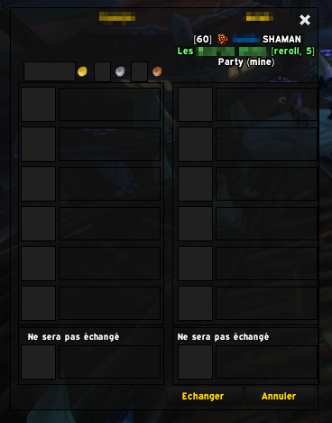

# WhoTrades (for retail, classic and ElvUI_CoolLine_Wrapper compatible)

Tells you who you are trading with with some details

Download [Curse page](https://www.curseforge.com/wow/addons/whotrades)

