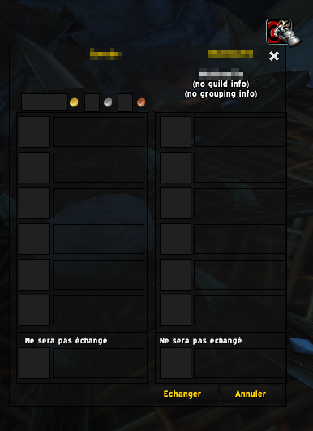

# WhoTrades (for retail & classic)

Tells you who you are trading with with some details

Download [Curse page](https://www.curseforge.com/wow/addons/whotrades)

If the addon can't find any info, it provides a Target button (inspired from WoWPro addon) that allows you to try to target the player.
If successful, the frame will update with the correct data.

